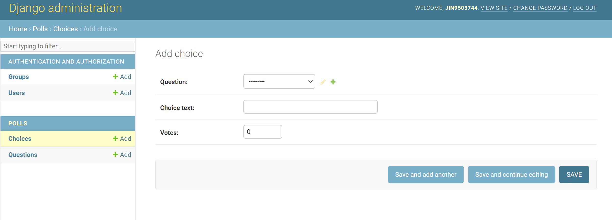

## 1. 파이썬 가상환경 세팅


### 가상환경 생성

python 3.3 이상의 버전 부터는 venv 모듈을 내장하고 있으므로 따로 설치없이 가능하다.

터미널을 열어 자신이 개발하려는 workspace 폴더에 가서 아래 명령어를 입력하자.

```bash
python3 -m venv venv-tutorial
```

venv-tutorial은 가상환경 이름이므로 자유롭게 쓰면 된다.

해당 구문을 실행하면 venv-tutorial 이름을 가진 가상 환경 폴더가 생성된다.

### 가상환경 실행

생성을 했으면 해당 가상환경을 실행해야한다.

실행 소스 파일은 가상 환경 폴더 안의 bin폴더 안에 있다.

```bash
source venv-tutorial/bin/activate
```

source 명령어를 통해 activate파일을 실행시켜 가상환경에 진입한다.

terminal 앞쪽에 (venv-tutorial)같이 가상환경의 이름이 붙으면 진입에 성공한 것이다.

pip list 명령어를 통해 설치된 패키지 버전들을 확인해보면 pip와 setuptools빼고는 아무것도 설치가 안된 깨끗한 상태임을 확인할 수 있다

***python3로 가상환경을 만들고 진입했으면 pip3 대신 pip명령어를 사용해도 된다.\***

### 가상환경 종료

가상환경을 종료하려면 deactivate 명령어를 사용하면 된다.

```bash
deactivate
```

터미널 앞에 가상환경 이름이 사라지면 정상적으로 종료된 것이다.


------

- #### 패키지 설치, 관리를 쉽게해보자 [pip freeze]

가상 환경은 좋긴하지만 환경을 만들때마다 매번 호환되는 패키지를 버전대로 설치하는 것은 굉장히 귀찮은 일이다.

pip에선 설치된 패키지를 정리하고 설치하는 루틴을 제공하는데 아래와 같이 사용해보자

먼저 위에 가상환경 설치 과정을 이용해서 envA와 envB 가상환경 2개를 만들어보자

envA에 설치된 패키지를 그대로 리스트업해서 envB에 옮기는 과정을 진행해보자

가상환경 생성후 envA에 진입한다.

```bash
python3 -m venv envA
python3 -m venv envB
source envA/bin/activate
```

실험을 위해 matplotlib 패키지를 하나 설치한 후 리스트를 확인해보자

```bash
pip install matlplitlib
pip list
```


위와 같은 패키지들이 설치되었는데 이 패키지들을 리스트업 해보자

```bash
pip freeze > requirements.txt
```

해당 명령어를 실행하면 실행한 위치에 requirements.txt가 생성된 것을 확인할 수 있다. (requirements.txt 파일명은 컨벤션이니 되도록 맞출것)


requirements.txt 안에 위와 같이 리스트업 된 것을 볼 수 있다.

이제 envB 가상환경에 진입해서 해당 파일을 install 하면 리스트의 패키지를 모두 설치한다.

```bash
pip install -r ./envA/requirements.txt
```

[설치 완료된 모습]


### 프로젝트 가상환경 세팅

~~~python
D:\Python\workspace>pip install virtualenv
D:\Python\workspace>virtualenv myenv
D:\Python\workspace\myenv\Scripts>activate.bat
(myenv) D:\Python\workspace\myenv\Scripts>pip install django
(myenv) D:\Python\workspace\myenv\Scripts>py -m django --version
4.0.3
(myenv) D:\Python\workspace\myenv\Scripts>python
Python 3.9.10 (tags/v3.9.10:f2f3f53, Jan 17 2022, 15:14:21) [MSC v.1929 64 bit (AMD64)] on win32
Type "help", "copyright", "credits" or "license" for more information.
>>> import django
>>> print(django.get_version())
4.0.3
~~~

Django_install_guide :  <https://docs.djangoproject.com/en/4.0/intro/install/>


## 2. Django Cycle, 프로젝트, 앱 생성, 서버 구동

### Django Cycle

[tornado response request cycle in Django](https://i.stack.imgur.com/rLfSC.jpg)


## 

### 프로젝트 생성, app 생성, 서버 구동

```
py manage.py runserver(myenv) D:\Python\workspace>django-admin startproject mysite
(myenv) D:\Python\workspace>py manage.py startapp polls
(myenv) D:\Python\workspace\mysite>py manage.py runserver
Watching for file changes with StatReloader
Performing system checks...
System check identified no issues (0 silenced).
You have 18 unapplied migration(s). Your project may not work properly until you apply the migrations for app(s): admin, auth, contenttypes, sessions.
Run 'python manage.py migrate' to apply them.
March 13, 2022 - 18:20:17
Django version 4.0.3, using settings 'mysite.settings'
Starting development server at http://127.0.0.1:8000/
Quit the server with CTRL-BREAK.

```


file:mysite/ 디렉토리 밖은 프로젝트를 담는 공간입니다. 그 이름은 Django 와 아무 상관이 없으니, 원하는 이름으로 변경해도 됩니다.

`manage.py`: Django 프로젝트와 다양한 방법으로 상호작용 하는 커맨드라인의 유틸리티 입니다. `manage.py` 에 대한 자세한 정보는 [django-admin and manage.py](https://docs.djangoproject.com/ko/4.0/ref/django-admin/) 에서 확인할 수 있습니다.

`mysite/` 디렉토리 내부에는 프로젝트를 위한 실제 Python 패키지들이 저장됩니다. 이 디렉토리 내의 이름을 이용하여, (`mysite.urls` 와 같은 식으로) 프로젝트의 어디서나 Python 패키지들을 임포트할 수 있습니다.

`mysite/__init__.py`: Python으로 하여금 이 디렉토리를 패키지처럼 다루라고 알려주는 용도의 단순한 빈 파일입니다. Python 초심자라면, Python 공식 홈페이지의 [패키지](https://docs.python.org/3/tutorial/modules.html#tut-packages)를 읽어보세요.

`mysite/settings.py`: 현재 Django 프로젝트의 환경 및 구성을 저장합니다. [Django settings](https://docs.djangoproject.com/ko/4.0/topics/settings/)에서 환경 설정이 어떻게 동작하는지 확인할 수 있습니다.

`mysite/urls.py`: 현재 Django project 의 URL 선언을 저장합니다. Django 로 작성된 사이트의 《목차》 라고 할 수 있습니다. [URL dispatcher](https://docs.djangoproject.com/ko/4.0/topics/http/urls/) 에서 URL 에 대한 자세한 내용을 읽어보세요.

`mysite/asgi.py`: 현재 프로젝트를 서비스하기 위한 ASGI-호환 웹 서버의 진입점입니다. 자세한 내용은 [ASGI를 사용하여 배포하는 방법](https://docs.djangoproject.com/ko/4.0/howto/deployment/asgi/) 를 참조하십시오.

`mysite/wsgi.py`: 현재 프로젝트를 서비스하기 위한 WSGI 호환 웹 서버의 진입점입니다. [WSGI를 사용하여 배포하는 방법](https://docs.djangoproject.com/ko/4.0/howto/deployment/wsgi/)를 읽어보세요.

- mysite/urls.py

```
from django.contrib import admin
from django.urls import include, path

urlpatterns = [
    path('polls/', include('polls.urls')),
    path('admin/', admin.site.urls),
]
```

- polls/urls.py

```
rom django.urls import path
from . import views

urlpatterns = [
    path('', views.index, name='index'),
]
```

- polls/views.py

```
from django.http import HttpResponse
def index(request):
    return HttpResponse("Hello, world. You're at the polls index.")
```

- Client(Browser)


Django_install_guide : https://docs.djangoproject.com/en/4.0/intro/tutorial01/


## 3. git 설치, git bash, github 사용법

### git bash & github  사용법 

git 설치, git 사용법, github 사용법
git bash = > 윈도우/리눅스 명령어 사용가능, 자동완성 사용가능(tab키), 상대경로 이동mkdir => 공백 / 한글 / .(온점) 사용하지 말것, 공백 파일 지정 시 ''(따옴표)로 묶음, 또는 _(언더바)로 띄어쓰기 표기

> git init


숨김파일 생성, 

 ls -a 로 숨김파일 확인가능


상위,하위 디렉터리 동시 생성 => -p 옵션


하위 폴더/디렉터리 같이 삭제 => -r 옵션


=> -f 옵션과 같이 사용가능, rmf -rf => 강제 삭제


> vim

vi 같은 문서 편집기

vi 명령어 사용 가능


> git 명령어

init => 초기화

$ git init


관리하고자 하는 디렉터리에만 사용할것


.git 생성 => 관리대상

$ git  => 명령어 확인

$ git status => 상태확인


$ git add <file>, . 은 모든 화일 => staging 영역에 올라감


$ git rm --cached <file>, . 은 모든화일 => staging 영역에서 제거

$ git commit, $ git commit -m "<메시지>" =>staging 영역의 working 디렉터리의 내용물을 git으로 관리


=> 이메일 / 이름 등록이 안돼서 오류


=> git 관리 사용자 확인을 위해 등록


$ git log, $ git log --oneline => git 시점 확인(사용자, 날짜, 커밋 메시지 확인가능)


$ git remote add <원격이름> => 원격이름은 github 주소 별칭같이 사용함, 깃허브 연동 보통 원격 이름은 origin 으로 사용


로그인


git bash 창


원격 연동 주소입력

$ git remote add origin https://github.com/donechoi/test.git

$ git remote rm origin => 원격 삭제 명령어 rm


깃허브는 commit 후에 올라간다

$ git push -u <원격지> <브런치> => -u : 업데이트


처음 push 하면 인증메시지 뜸 => 인증하면됨


새로고침하면 확인 가능


컴퓨터에 연결된  깃허브 계정 확인가능

기타 Git Bash 빠져나가기 

- git log, nano 편집기 나가기 => **q**
- vi편집기 나가기 => **:wq** *write and quit(저장하고 나가기의 줄임말)*
- server 종료하기 => **Ctrl + c**
- SQL에서 리눅스로 나가기 => **i** *sql -> 리눅스*, **exit** *리눅스 -> sql


### 프로젝트 git 등록 

```objc
Administrator@DESKTOP-L5USBSK MINGW64 /d/Python/workspace/mysite
$ git init
Initialized empty Git repository in D:/Python/workspace/mysite/.git/

Administrator@DESKTOP-L5USBSK MINGW64 /d/Python/workspace/mysite (master)
$ ls
db.sqlite3  mysite/  readme.assets/  scr1.png
manage.py*  polls/   readme.md       scr2.png

Administrator@DESKTOP-L5USBSK MINGW64 /d/Python/workspace/mysite (master)
$ git add .

Administrator@DESKTOP-L5USBSK MINGW64 /d/Python/workspace/mysite (master)
$ git commit
[master (root-commit) 4f4cc38] first commit
 28 files changed, 415 insertions(+)
 create mode 100644 db.sqlite3
 create mode 100644 manage.py
 create mode 100644 mysite/__init__.py
 create mode 100644 mysite/__pycache__/__init__.cpython-39.pyc
 create mode 100644 mysite/__pycache__/settings.cpython-39.pyc
 create mode 100644 mysite/__pycache__/urls.cpython-39.pyc
 create mode 100644 mysite/__pycache__/wsgi.cpython-39.pyc
 create mode 100644 mysite/asgi.py
 create mode 100644 mysite/settings.py
 create mode 100644 mysite/urls.py
 create mode 100644 mysite/wsgi.py
 create mode 100644 polls/__init__.py
 create mode 100644 polls/__pycache__/__init__.cpython-39.pyc
 create mode 100644 polls/__pycache__/urls.cpython-39.pyc
 create mode 100644 polls/__pycache__/views.cpython-39.pyc
 create mode 100644 polls/admin.py
 create mode 100644 polls/apps.py
 create mode 100644 polls/migrations/__init__.py
 create mode 100644 polls/models.py
 create mode 100644 polls/tests.py
 create mode 100644 polls/urls.py
 create mode 100644 polls/views.py
 create mode 100644 readme.assets/image-20220313191518852.png
 create mode 100644 readme.assets/scr1.png
 create mode 100644 readme.assets/scr2.png
 create mode 100644 readme.md
 create mode 100644 scr1.png
 create mode 100644 scr2.png

Administrator@DESKTOP-L5USBSK MINGW64 /d/Python/workspace/mysite (master)
$ git log
commit (HEAD -> master)
Author: LEEYOUNGJIN1 <*************@naver.com>
Date:   Sun Mar 13 22:37:06 2022 +0900
first commit
Administrator@DESKTOP-L5USBSK MINGW64 /d/Python/workspace/mysite (master)

Administrator@DESKTOP-L5USBSK MINGW64 /d/Python/workspace/mysite (master)
$ git remote add origin https://github.com/LEEYOUNGJIN1/mysite.git

Administrator@DESKTOP-L5USBSK MINGW64 /d/Python/workspace/mysite (master)
$ git push -u origin master
Enumerating objects: 31, done.
Counting objects: 100% (31/31), done.
Delta compression using up to 8 threads
Compressing objects: 100% (29/29), done.
Writing objects: 100% (31/31), 129.50 KiB | 12.95 MiB/s, done.
Total 31 (delta 1), reused 0 (delta 0), pack-reused 0
remote: Resolving deltas: 100% (1/1), done.
To https://github.com/LEEYOUNGJIN1/mysite.git

 * [new branch]      master -> master
   Branch 'master' set up to track remote branch 'master' from 'origin'.

Administrator@DESKTOP-L5USBSK MINGW64 /d/Python/workspace/mysite (master)
```


## 4. 앱 작성하기 - 1

Django_install_guide : https://docs.djangoproject.com/en/4.0/intro/tutorial02/

### 프로젝트 데이터베이스 설치(**SQLite** )

데이터베이스는 SQLite를 사용함.

**mysite/settings.py**

```
        'ENGINE': 'django.db.backends.sqlite3',
        'NAME': 'mydatabase',
    }
}
```

```
(myenv) D:\Python\workspace\mysite>py manage.py migrate
Operations to perform:
  Apply all migrations: admin, auth, contenttypes, sessions
Running migrations:
  Applying contenttypes.0001_initial... OK
  Applying auth.0001_initial... OK
  Applying admin.0001_initial... OK
  Applying admin.0002_logentry_remove_auto_add... OK
  Applying admin.0003_logentry_add_action_flag_choices... OK
  Applying contenttypes.0002_remove_content_type_name... OK
  Applying auth.0002_alter_permission_name_max_length... OK
  Applying auth.0003_alter_user_email_max_length... OK
  Applying auth.0004_alter_user_username_opts... OK
  Applying auth.0005_alter_user_last_login_null... OK
  Applying auth.0006_require_contenttypes_0002... OK
  Applying auth.0007_alter_validators_add_error_messages... OK
  Applying auth.0008_alter_user_username_max_length... OK
  Applying auth.0009_alter_user_last_name_max_length... OK
  Applying auth.0010_alter_group_name_max_length... OK
  Applying auth.0011_update_proxy_permissions... OK
  Applying auth.0012_alter_user_first_name_max_length... OK
  Applying sessions.0001_initial... OK
```

[`migrate`](https://docs.djangoproject.com/ko/4.0/ref/django-admin/#django-admin-migrate) 명령은 [`INSTALLED_APPS`](https://docs.djangoproject.com/ko/4.0/ref/settings/#std:setting-INSTALLED_APPS) 의 설정을 탐색하여, `mysite/settings.py` 의 데이터베이스 설정과 app 과 함께 제공되는 database migrations 에 따라, 필요한 데이터베이스 테이블을 생성합니다. 이 명령을 수행하면 각 migration 이 적용되는 메세지가 화면에 출력되는 것을 확인할 수 있습니다. 

### 모델 만들기

여론조사 앱에서 `Question` 과 `Choice``이라는 두 가지 모델을 만들 것입니다.`

 ``Question` 에는 질문과 발행일을 위한 두 개의 필드를 가집니다. `Choice` 는 선택 텍스트와 투표 집계를 위한 두 개의 필드를 가집니다. 

이러한 개념은 Python 클래스로 표현됩니다. file:polls/models.py 파일을 다음과 같이 수정하십시오.

**polls/models.py**

```
from django.db import models

class Question(models.Model):
    question_text = models.CharField(max_length=200)
    pub_date = models.DateTimeField('date published')

class Choice(models.Model):
    question = models.ForeignKey(Question, on_delete=models.CASCADE)
    choice_text = models.CharField(max_length=200)
    votes = models.IntegerField(default=0)
```

각 모델의 class는 django.db.models.Model의 하위 클래스로 표현됩니다. 

모델마다 여러 클래스 변수가 있으며, 각 클래스 변수는 모델에서 데이터베이스 필드를 나타냅니다.

데이터베이스의 각 필드는 [`Field`](https://docs.djangoproject.com/ko/4.0/ref/models/fields/#django.db.models.Field) 클래스의 인스턴스로서 표현됩니다. 

- [ ] 각각의 [`Field`](https://docs.djangoproject.com/ko/4.0/ref/models/fields/#django.db.models.Field) 인스턴스의 이름(`question_text` 또는 `pub_date`)는 데이터베이스에서는 컬럼명
- [ ] CharField는 문자(character) 필드 :  [`max_length`]의 속성(인자) 필요
- [ ] DateTimeField는 날짜와 시간(datetime) 필드
- [ ] `votes` 는 숫자(IntegerField) 필드 : [`default`](https://docs.djangoproject.com/ko/4.0/ref/models/fields/#django.db.models.Field.default) (기본값)  0 
- [ ] [`ForeignKey`]는 하나의 `Question`에 각각의 `Choice` 가 관계됨 : 일-대-다(one-to-one)


### 모델의 활성화

앱을 현재의 프로젝트에 포함시키기 위해서는, 앱의 구성 클래스에 대한 참조를 [`INSTALLED_APPS`](https://docs.djangoproject.com/ko/4.0/ref/settings/#std:setting-INSTALLED_APPS) 설정에 추가해야 함.

**polls/apps.py** - PollsConfig 클래스 

```class PollsConfig(AppConfig):
from django.apps import AppConfig

class PollsConfig(AppConfig):
    default_auto_field = 'django.db.models.BigAutoField'
    name = 'polls'
```

경로는 `'polls.apps.PollsConfig'`로 `mysite/settings.py` 파일의 ['INSTALLED_APPS`]에 추가.

**mysite/settings.py** 

```python
INSTALLED_APPS = [
    'django.contrib.admin',
    'django.contrib.auth',
    'django.contrib.contenttypes',
    'django.contrib.sessions',
    'django.contrib.messages',
    'django.contrib.staticfiles',
    'polls.apps.PollsConfig' # app경로 추가
]
```

```python
(myenv) D:\Python\workspace\mysite>py manage.py makemigrations polls
Migrations for 'polls':
  polls\migrations\0001_initial.py
    - Create model Question
    - Create model Choice

(myenv) D:\Python\workspace\mysite>py manage.py migrate
Operations to perform:
  Apply all migrations: admin, auth, contenttypes, polls, sessions
Running migrations:
  Applying polls.0001_initial... OK
  
(myenv) D:\Python\workspace\mysite>py manage.py sqlmigrate polls 0001
BEGIN;
--
-- Create model Question
--
CREATE TABLE "polls_question" ("id" integer NOT NULL PRIMARY KEY AUTOINCREMENT, "question_text" varchar(200) NOT NULL, "pub_date" datetime NOT NULL);
--
-- Create model Choice
--
CREATE TABLE "polls_choice" ("id" integer NOT NULL PRIMARY KEY AUTOINCREMENT, "choice_text" varchar(200) NOT NULL, "votes" integer NOT NULL, "question_id" bigint NOT NULL REFERENCES "polls_question" ("id") DEFERRABLE INITIALLY DEFERRED);
CREATE INDEX "polls_choice_question_id_c5b4b260" ON "polls_choice" ("question_id");
COMMIT;
```

[`migrate`]명령은 아직 적용되지 않은 마이그레이션을 모두 수집, 실행하며 모델의 변경 사항들과 데이터베이스의 스키마를 동기화.

- project폴더 **settings.py**에  **apps** 경로 추가 => 'polls.apps.PollsConfig' [polls/apps.py에서 확인]
- models.py에서 모델 생성.
- [`python manage.py makemigrations`]을 통해 이 변경사항에 대한 마이그레이션 생성.
- [`python manage.py migrate`]를 통해 변경사항을 데이터베이스에 적용.

마이그레이션을 만드는 명령과 적용하는 명령이 분리된 것은 버전 관리 시스템에 마이그레이션을 커밋하고 앱과 함께 출시할 수 있도록 하기 위함.

### 참조1. 기타 데이터베이스 설치

#### 1) **Postgresql** 데이터베이스 설치

패키지 설치 : 독립된 가상환경에서 `psycopg2` 파이썬 패키지를 설치.

```
pip install psycopg2
```

데이터베이스 및 사용자 추가 : 데이터베이스와 사용자를 추가하기 위해 `psql` 콘솔을 아래와 같이 실행.

```
sudo su - postgres
psql
psql (9.5.4)
Type "help" for help.
```

아래와 같이 `django_test` 데이터베이스와 시스템 계정이 아닌 데이터베이스 사용자 `django_user`를 추가한다.

```
CREATE DATABASE django_test;
CREATE USER django_user WITH PASSWORD 'django_pass';
ALTER ROLE django_user SET client_encoding TO 'utf8';
ALTER ROLE django_user SET default_transaction_isolation TO 'read committed';
ALTER ROLE django_user SET timezone TO 'UTC';
GRANT ALL PRIVILEGES ON DATABASE django_test TO django_user;
\q
```

데이터베이스와 사용자를 추가하고 권한까지 부여했으므로 `psql` 사용자에서 빠져나온다.

```
exit
```

데이터베이스 접속 설정 : conf/settings.py` 파일에서 데이터베이스 연결 설정을 아래와 같이 수정한다. 데이터 접속 정보는 앞서 데이터베이스 생성할 때 입력한 데이터베이스 이름, 아이디, 비밀번호와 같다.

```
DATABASES = {
    'default': {
        'ENGINE': 'django.db.backends.postgresql_psycopg2',
        'NAME': 'django_test',
        'USER': 'django_user',
        'PASSWORD': 'django_pass',
        'HOST': 'localhost',
        'PORT': '',
    }
}
```

자세한 내용은 [`HOST`](https://docs.djangoproject.com/ko/4.0/ref/settings/#std:setting-HOST)를 참조하십시오.

```
DATABASES = {
    'default': {
        'ENGINE': 'django.db.backends.postgresql',
        'NAME': 'mydatabase',
        'USER': 'mydatabaseuser',
        'PASSWORD': 'mypassword',
        'HOST': '127.0.0.1',
        'PORT': '5432',
    }
}
```

보다 복잡한 구성에 필요할 수 있는 다음 내부 옵션을 사용할 수 있습니다.

[연결 서비스 파일](https://www.postgresql.org/docs/current/libpq-pgservice.html) 의 서비스 이름 과 [비밀번호 파일](https://www.postgresql.org/docs/current/libpq-pgpass.html)[`OPTIONS`](https://docs.djangoproject.com/ko/4.0/ref/settings/#std:setting-OPTIONS) 의 비밀번호를 사용하여 연결하려면 다음에서 데이터베이스 구성 의 일부에 이를 지정해야 합니다 [`DATABASES`](https://docs.djangoproject.com/ko/4.0/ref/settings/#std:setting-DATABASES).

settings.py [¶](https://docs.djangoproject.com/ko/4.0/ref/databases/#id16)

```
DATABASES = {
    'default': {
        'ENGINE': 'django.db.backends.postgresql',
        'OPTIONS': {
            'service': 'my_service',
            'passfile': '.my_pgpass',
        },
    }
}
```

.pg_service.conf [¶](https://docs.djangoproject.com/ko/4.0/ref/databases/#id17)

```
[my_service]
host=localhost
user=USER
dbname=NAME
port=5432
```

.my_pgpass [¶](https://docs.djangoproject.com/ko/4.0/ref/databases/#id18)

```
localhost:5432:NAME:USER:PASSWORD
```

Django 4.0에서 변경된 사항:

서비스 이름으로 연결하고 암호 파일을 지정하는 지원이 추가되었습니다.


#### 2) MySQL 데이터베이스 설치

Django 에서는 기본적으로 sqlite3와 연동된다. 따라서 MySQL을 사용하고 싶다면, 설정을 해주어야한다.

파이썬에서는 `mysqlclient`라는 라이브러리를 통해 MySQL과 DB를 연동할 수 있다.

먼저 작업을 할 가상환경으로 진입한 후 설치해주자

```python
pip3 install mysqlclient
```

이제 실제 장고 세팅에 들어가서 데이터베이스를 MySQL로 쓰겠다는 설정을 해줘야한다.

수정하기 전에 나는 `my_settings.py`파일을 하나 생성해서 그 안에 데이터베이스를 연동시키는 정의를 입력하고, `my_settings.py`를 임포트해서 사용했다.

- my_setting.py파일 생성

```python
touch my_settings.py
```

- 생성 된 my_settings.py에 다음과 같이 입력해준다.

```python
DATABASES = {
    'default' : {
        'ENGINE': 'django.db.backends.mysql',    [1]
        'NAME': 'starbucks',                     [2]
        'USER': 'root',                          [3]
        'PASSWORD': 'password',                  [4]
        'HOST': 'localhost',                     [5]
        'PORT': '3306',                          [6]
    }
}
```

위 명령에 대한 설명은 다음과 같다.

[ 1 ] : 사용할 엔진 설정. 그대로 두면 됨

[ 2 ] : 연동할 MySQL의 데이터베이스 이름

[ 3 ] : DB 접속 계정명

[ 4 ] : 해당 DB 접속 계정 비밀번호

[ 5 ] : 실제 DB 주소, 따로 설정 안했으면 그대로 두면 됨

[ 6 ] : 포트번호, 따로 설정 안했으면 그대로 두면 됨

------

- 기존 settings.py에서 연동시켜준다.

현재 상태에서 settings.py를 확인해보면 데이터베이스 부분에 다음과 같이 설정되어 있을 것이다.

```python
DATABASES = {
    'default': {
        'ENGINE': 'django.db.backends.sqlite3',
        'NAME': os.path.join(BASE_DIR, 'db.sqlite3'),
    }
}
```

이 부분을 다음과 같이 수정해주자

```python
import my_settings

DATABASES = my_settings.DATABASES
```

이제 실제로 사용할 데이터베이스를 생성한다.

- `mysql -u root -p` 명령을 통해 Mysql을 실행시킨 후 다음의 명령어로 데이터베이스를 만들어준다.

```sql
mysql> CREATE DATABASE starbucks CHARACTER SET utf8mb4 COLLATE utf8mb4_general_ci;
```

- 제대로 생성 되었는지 확인해보자

```sql
mysql> show databases;
+--------------------+
| Database           |
+--------------------+
| information_schema |
| mysql              |
| mysql_test         |
| performance_schema |
| starbucks          |
| sys                |
+--------------------+
6 rows in set (0.01 sec)
```

생성이 제대로 된 것을 확인할 수 있다. 이 생성 한 데이터베이스를 사용하기 위해선 다음의 명령어를 입력한다.

```sql
mysql> use starbucks;
Database changed
mysql> show tables;
Empty set (0.01 sec)
```

데이터베이스가 변경되었고, 아직 테이블을 생성하지 않았기 때문에 테이블이 없다는 메세지를 반환해준다.

설정 교체가 완료된 후 `python3 manage.py migrate`를 실행해 데이터베이스에 테이블을 만들어준다.


show tables; 로 확인해보면 테이블이 정상적으로 생성 된 것을 확인할 수 있다.


데이터베이스에 값을 저장하는 스크립트 파일을 생성해뒀다면 스크립트 파일을 실행해주면 테이블에 값이 저장되는 것을 확인.


#### 3) Oracle 데이터베이스 설치

일단 oracle은 11g를 사용하였고, 클라이언트는 sql developer를 사용하였다.

\- 오라클 설치: http://all-record.tistory.com/37

\- sql developer 설치: http://all-record.tistory.com/76

Local 오라클과 연동하기

오라클과 sql developer를 모두 설치하였다면 sql developer를 켠다. 

-오라클을 설치하고 나서 window 탐색기에 sql이라고 입력하면 Run SQL Command Line이 뜬다. 이걸 실행한다.


여기서 오라클 계정을 만들어 줘야한다. 나는 USER이름과 비밀번호를 모두 DJANGOTEST로 하였다. 아래까지 모두 제대로 뜨면 된거고 안되면 이제 큰일난거다. 에러 문구대로 구글에 물어보면 stack overflow에서 잘알려준다. 나는 에러난 적이 없는데 나시는 분들 컴퓨터 새로 사는 것도 좋은 방법이다.


잘 되고나면 sql developer를 켠다


여기서 새접속을 만든다


접속이름은 아무렇게나 원하는 이름을 하시면 되고, 사용자 이름과 비밀번호는 위에서 설정한대로 하면 된다. 

나는 둘다 DJANGOTEST. 나머지 설정은 그대로 둔다. 아래에 테스트를 하고 성공이라고 뜨면 잘된거다.


새로고침 하면 잘뜬걸 볼수있다.


이제 장고 파일 중 settings.py를 키고 설정을 바꿔야한다.


열어보면 아래에 DATABASES설정이 sqlite3로 되어있다.


아래처럼 설정을 변경하면 오라클과 연동을 할수있다. 


이것도 Settings.py 파일에서 바꾸어 주면 좋다. 이렇게 바꿔줘야 데이터베이스에 현재 시간을 입력할때 제대로된 한국 시간이 들어가기 때문이다.


이제 패키지 하나만 더깔면 된다. env위에서 우클릭하고 파이썬 패키지 설치를 선택한다.


여기서 cx_Oracle을 입력하고 설치한다. (cmd를 이용하는 경우 pip install cx_Oracle)


잘 설치되는 것을 볼 수 있다.


이전 튜토리얼에서 했던 방법대로 슈퍼사용자를 다시 한번 만든다(django/ django1234). 

그다음 마이그레이션을 makemigrate와 migrate 순서대로 진행한다.


\- migrate!


새로고침하면 테이블이 짜잔하고 생긴다


### 참조2. API활용

대화식 Python 쉘에 뛰어들어 Django API를 자유롭게 활용하는 방법

Python 쉘을 실행하려면 다음의 명령을 입력합니다.


### 참조3. django admin 사용법

> ##### 관리자 생성하기
>
> ```D:\Python\workspace>cd D:\Python\workspace\myenv\Scripts
> D:\Python\workspace\myenv\Scripts>activate.bat
> (myenv) D:\Python\workspace\mysite>python manage.py createsuperuser
> Username (leave blank to use 'administrator'): *********
> Email address: *********@naver.com
> Password:
> Password (again):
> The password is too similar to the username.
> Bypass password validation and create user anyway? [y/N]: y
> Superuser created successfully.~~~
> ```
>
> ##### 개발 서버 시작
>
> ```(myenv) D:\Python\workspace\mysite>python manage.py runserver
> (myenv) D:\Python\workspace\mysite>python manage.py runserver
> Watching for file changes with StatReloader
> Performing system checks...
> 
> System check identified no issues (0 silenced).
> March 15, 2022 - 12:19:03
> Django version 4.0.3, using settings 'mysite.settings'
> Starting development server at http://127.0.0.1:8000/
> Quit the server with CTRL-BREAK.
> ```
>
> 웹 브라우저 ;  http://127.0.0.1:8000/admin/). : 관리자의 로그인 화면.
>
> 
>
> translation이 기본적으로 설정되어 있으므로 [`LANGUAGE_CODE`](https://docs.djangoproject.com/ko/4.0/ref/settings/#std:setting-LANGUAGE_CODE) 를 설정하면, 로그인 화면이 지정된 언어로 표시됨
>
> (Django 번역이 적절한 경우).
>
> 슈퍼유저(superuser) 계정으로 로그인 : Django 관리 인덱스 페이지.
>
> 
>
> 
>
> 편집 가능한 그룹과 사용자와 같은 몇 종류의 컨텐츠를 볼 수 있습니다. 이것들은 [`django.contrib.auth`](https://docs.djangoproject.com/ko/4.0/topics/auth/#module-django.contrib.auth) 모듈에서 제공되는데, Django 에서 제공되는 인증 프레임.
>
> mysite/urls.py
>
> ```python
> from django.contrib import admin
> from django.urls import include, path
> 
> urlpatterns = [
>   path('polls/', include('polls.urls')),
>   path('admin/', admin.site.urls), # admin url 경로
> ]
> ```
>
> `Question` 모델을 `admin.site.register(Question)`에 등록함으로써, Django는 디폴트 폼 표현을 구성 함. 
>
> 관리 폼이 보이고 작동하는 방법을 커스터마이징하려면 객체를 등록 할 때 Django에 원하는 옵션을 알려주면 커스터마이징 할 수 있습니다.
>
> 모델의 관리자 옵션을 변경해야 할 때마다 모델 어드민(QuestionAdmin) 클래스를 만든 다음, `admin.site.register()`에 두 번째 인수로 전달함.
>
> polls/admin.py : 
>
> 
>
> ```python
> from django.contrib import admin
> from .models import Question
> 
> class QuestionAdmin(admin.ModelAdmin):
>     fields = ['pub_date', 'question_text']
>     
> admin.site.register(Question, QuestionAdmin) # adming화면 모델등록
> ```
>
> 
>
> polls/admin.py : 
>
> ```python
> class QuestionAdmin(admin.ModelAdmin):
>     fieldsets = [
>         ('Question_text', {'fields': ['question_text']}),
>         ('Date information', {'fields': ['pub_date']}),
>     ]
> 
> admin.site.register(Question, QuestionAdmin) 
> ```
>
> 
>
> ##### 관련된 개체 추가
>
> Question 관리자 페이지는 여러 개의 `Choice`들을 가지고 있음에도 admin 페이지에 표시하지 못함.
>
> 관련된 객체인 Choice를 관리자 페이지에 등록.
>
> polls/admin.py : 
>
> ```python
> from django.contrib import admin
> from .models import Question, Choice
> 
> class QuestionAdmin(admin.ModelAdmin):
>     fieldsets = [
>         ('Question_text',               {'fields': ['question_text']}),
>         ('Date information', {'fields': ['pub_date']}),
>     ]
> 
> admin.site.register(Question, QuestionAdmin) 
> admin.site.register(Choice) # adming화면 모델등록
> ```
>
>   `Question` 객체를 생성할 때 여러 개의 Choices를 직접 추가
>
> 관련된 선택 사항을 세개로 지정(extra = 3).
>
> 이미 생성된 객체의 “Change” 페이지의 경우에도 빈 세 개가 생김.
>
> polls/admin.py : 
>
> ```python
> from django.contrib import admin
> from .models import Question, Choice
> 
> class ChoiceInline(admin.StackedInline):
>     model = Choice
>     extra = 3
> 
> class QuestionAdmin(admin.ModelAdmin):
>     fieldsets = [
>         ('Question_text',  {'fields': ['question_text']}),
>         ('Date information', {'fields': ['pub_date'], 'classes': ['collapse']}),
>     ]
>     inlines = [ChoiceInline]
> 
> admin.site.register(Question, QuestionAdmin)
> ```
>
> 
>
> 
>
> `StackedInline` 대신에 `TabularInline`을 사용하면, 좀 더 조밀하고 테이블 기반 형식으로 표시됨
>
> polls/admin.py : 
>
> ```
> admin.site.register(Question, QuestionAdmin) 
> admin.site.register(Choice)
> 
> class ChoiceInline(admin.TabularInline):    
>     model = Choice
>     extra = 3
> 
> class QuestionAdmin(admin.ModelAdmin):
>     fieldsets = [
>         ('Question_text', {'fields': ['question_text']}),
>         ('Date information', {'fields': ['pub_date'], 'classes': ['collapse']}),
>     ]
>     inlines = [ChoiceInline]
> 
> admin.site.register(Question, QuestionAdmin)
> ```
>
> 
>
> [`list_display`] 옵션을 사용하면 객체의 변경 목록 페이지에 열로 필드 이름 표시.
>
> polls/admin.py : 
>
> ```python
> admin.site.register(Question, QuestionAdmin) 
> admin.site.register(Choice)
> 
> class ChoiceInline(admin.TabularInline):    
>     model = Choice
>     extra = 3
> 
> class QuestionAdmin(admin.ModelAdmin):
>     fieldsets = [
>        ('Question_text', {'fields': ['question_text']}),
>        ('Date information', {'fields': ['pub_date'], 'classes': ['collapse']}),]
>     inlines = [ChoiceInline]
>     list_display = ('question_text', 'pub_date', 'was_published_recently')
> 
> admin.site.register(Question, QuestionAdmin)
> 
> ```
>
> 
>
> 
> `was_published_recently` 헤더의 경우를 제외하고 그 값으로 정렬하기 위해 열 머리글을 클릭 할 수 있습니다. 왜냐하면 임의의 메서드의 출력에 의한 정렬은 지원되지 않기 때문입니다. 또한 `was_published_recently`에 대한 열 머리글은 기본적으로 메서드 이름 (밑줄을 공백으로 대체)이며 각 줄에는 출력의 문자열 표현이 포함되어 있습니다.
>
> Decorator를 통해 구성할 수 있는 속성
>
> ```python
> import datetime
> 
> from django.db import models
> from django.utils import timezone
> from django.contrib import admin
> 
> class Question(models.Model):
>     question_text = models.CharField(max_length=200)
>     pub_date = models.DateTimeField('date published')
>     
>     @admin.display(
>         boolean=True,
>         ordering='pub_date',
>         description='Published recently',
>     )
>     def was_published_recently(self):
>         now = timezone.now()
>         return now - datetime.timedelta(days=1) <= self.pub_date <= now
> 
> class Choice(models.Model):
>     question = models.ForeignKey(Question, on_delete=models.CASCADE)
>     choice_text = models.CharField(max_length=200)
>     votes = models.IntegerField(default=0)
>     
>     def __str__(self):
>         return self.choice_text
> ```
>
> 
>
> 
>
> [`list_filter`](https://docs.djangoproject.com/ko/4.0/ref/contrib/admin/#django.contrib.admin.ModelAdmin.list_filter)를 사용. `QuestionAdmin`에 pub_date별 항목추가
>
> `pub_date` 필드에 의해 사람들이 변경 목록을 필터링 할 수 있게 해주는 “Filter” 사이드 바가 추가
>
> pub_date`는 “Any date”, “Today”, “Past 7 days”, “This month”, “This year” 등의 적절한 필터 옵션 제공.
>
> polls/admin.py : 
>
> ```python
> from django.contrib import admin
> from .models import Choice, Question
> 
> class ChoiceInline(admin.TabularInline):    
>     model = Choice
>     extra = 3
> 
> class QuestionAdmin(admin.ModelAdmin):
>     fieldsets = [
>         ('Question_text', {'fields': ['question_text']}),
>         ('Date information', {'fields': ['pub_date'], 'classes': ['collapse']}),
>     ]
>     inlines = [ChoiceInline]
>     list_display = ('question_text', 'pub_date', 'was_published_recently')
>     list_filter = ['pub_date'] # 필터추가
>     
> 
> admin.site.register(Question, QuestionAdmin)
> ```
>
> 
>
> 검색 기능을 추가
>
> polls/admin.py : 
>
> ```python
> from django.contrib import admin
> from .models import Choice, Question
> 
> # class ChoiceInline(admin.StackedInline):
> class ChoiceInline(admin.TabularInline):    
>     model = Choice
>     extra = 3
> 
> class QuestionAdmin(admin.ModelAdmin):
>     fieldsets = [
>         ('Question_text', {'fields': ['question_text']}),
>         ('Date information', {'fields': ['pub_date'], 'classes': ['collapse']}),
>     ]
>     inlines = [ChoiceInline]
>     list_display = ('question_text', 'pub_date', 'was_published_recently')
>     list_filter = ['pub_date']
>     search_fields = ['question_text'] # 결색 필터 추가
>     
> admin.site.register(Question, QuestionAdmin)
> ```
>
> 
>
> ##### *프로젝트의*  템플릿 커스터마이징
>
> 프로젝트 디렉토리 (`manage.py`를 포함하고있는)에 `templates` 디렉토리를 만듬
>
> 템플릿은 장고가 액세스 할 수있는 파일 시스템 어디에서나 사용할 수 있슴
>
> 다만 프로젝트 내에 템플릿을 유지하는 것은 따라야 할 좋은 규칙임.
>
> mysite/settings.py에 [`DIRS`] 옵션을 [`TEMPLATES`] 설정에 추가
>
> mysite/settings.py
>
> ```python
> from pathlib import Path
> 
> SECRET_KEY = '*********************************'
> DEBUG = True
> ALLOWED_HOSTS = []
> 
> INSTALLED_APPS = [
>     'django.contrib.admin',
>     'django.contrib.auth',
>     'django.contrib.contenttypes',
>     'django.contrib.sessions',
>     'django.contrib.messages',
>     'django.contrib.staticfiles',
>     'polls.apps.PollsConfig'
> ]
> 
> MIDDLEWARE = [
>     'django.middleware.security.SecurityMiddleware',
>     'django.contrib.sessions.middleware.SessionMiddleware',
>     'django.middleware.common.CommonMiddleware',
>     'django.middleware.csrf.CsrfViewMiddleware',
>     'django.contrib.auth.middleware.AuthenticationMiddleware',
>     'django.contrib.messages.middleware.MessageMiddleware',
>     'django.middleware.clickjacking.XFrameOptionsMiddleware',
> ]
> 
> ROOT_URLCONF = 'mysite.urls'
> 
> TEMPLATES = [
>     {
>         'BACKEND': 'django.template.backends.django.DjangoTemplates',
>         'DIRS': [BASE_DIR / 'templates'], # 템플릿 경로 추가
>         'APP_DIRS': True,
>         'OPTIONS': {
>             'context_processors': [
>                 'django.template.context_processors.debug',
>                 'django.template.context_processors.request',
>                 'django.contrib.auth.context_processors.auth',
>                 'django.contrib.messages.context_processors.messages',
>             ],
>         },
>     },
> ]
> 
> WSGI_APPLICATION = 'mysite.wsgi.application'
> 
> DATABASES = {
>     'default': {
>         'ENGINE': 'django.db.backends.sqlite3',
>         'NAME': BASE_DIR / 'db.sqlite3',
>     }
> }
> 
> AUTH_PASSWORD_VALIDATORS = [
>     {
>         'NAME': 'django.contrib.auth.password_validation.UserAttributeSimilarityValidator',
>     },
>     {
>         'NAME': 'django.contrib.auth.password_validation.MinimumLengthValidator',
>     },
>     {
>         'NAME': 'django.contrib.auth.password_validation.CommonPasswordValidator',
>     },
>     {
>         'NAME': 'django.contrib.auth.password_validation.NumericPasswordValidator',
>     },
> ]
> 
> LANGUAGE_CODE = 'en-us'
> TIME_ZONE = 'UTC'
> USE_I18N = True
> USE_TZ = True
> 
> STATIC_URL = 'static/'
> DEFAULT_AUTO_FIELD = 'django.db.models.BigAutoField'
> ```
>
> 장고 소스 코드 디렉토리(`django/contrib/admin/templates`) 에 기본 관리자 템플릿 디렉토리 안에 있는 admin/base_site.html` 템플릿을 방금 만든 디렉토리로 복사합니다.
>
> 장고 소스 코드 디렉토리 
>
> ```python
> PS D:\Python\workspace\mysite> python -c "import django; print(django.__path__)"
> ['D:\\Python\\lib\\site-packages\\django']
> ```
>
> *templates/admin/base_site.html*
>
> ```html
> 
> 
> {{ subtitle }} | {{ title }} | {{ site_title|default:_('Django site admin') }}
> 
> 
> <h1 id="site-name"><a href="">Polls Administration</a></h1>
> 
> 
> 
> ```
>
> *admin/base_site.html*
>
> 

## 5. 앱 작성하기 - 2

### 뷰 추가하기

polls/views.py` 에 뷰를 추가

**polls/views.py**

```python
from django.shortcuts import render
from django.http import HttpResponse
from .models import Question

def index(request):
    latest_question_list = Question.objects.order_by('-pub_date')[:5]
    output = ', '.join([q.question_text for q in latest_question_list])
    return HttpResponse(output)
    
def detail(request, question_id):
    return HttpResponse("You're looking at question %s." % question_id)

def results(request, question_id):
    response = "You're looking at the results of question %s."
    return HttpResponse(response % question_id)

def vote(request, question_id):
    return HttpResponse("You're voting on question %s." % question_id)
```

[`path()`](https://docs.djangoproject.com/ko/4.0/ref/urls/#django.urls.path) 호출을 추가하여 이러한 새로운 뷰를 `polls.urls` 모듈로 연결하세요.

**mysite/urls.py**

````
from django.contrib import admin
from django.urls import include, path

urlpatterns = [
    path('polls/', include('polls.urls')),
    path('admin/', admin.site.urls),
]
````

**polls/urls.py**

```python
from django.urls import path
from . import views

urlpatterns = [
    # ex: /polls/
    path('', views.index, name='index'),
    # ex: /polls/5/
    path('<int:question_id>/', views.detail, name='detail'),
    # ex: /polls/5/results/
    path('<int:question_id>/results/', views.results, name='results'),
    # ex: /polls/5/vote/
    path('<int:question_id>/vote/', views.vote, name='vote'),
]
```

브라우저에 “http://127.0.0.1:8000/polls/34/” 를 입력하면  detail()` 함수를 호출하여 URL 에 출력할 것임

```
You're looking at question 34.
```

브라우저에 “http://127.0.0.1:8000/polls/34/results/” 를 입력하면  detail()` 함수를 호출하여 URL 에 출력할 것임

```
You're looking at the results of question 34.
```

브라우저에 “http://127.0.0.1:8000/polls/34/vote/” 를 입력하면  detail()` 함수를 호출하여 URL 에 출력할 것임 

```
You're voting on question 34.
```

투표 결과와 투표 페이지의 뼈대가 되는 페이지가 출력될 것입니다.

사용자가 웹사이트의 페이지를 요청을 하면 **mysite/settings.py**의  [`ROOT_URLCONF`](https://docs.djangoproject.com/ko/4.0/ref/settings/#std:setting-ROOT_URLCONF) 설정에 의해  `mysite.urls`에서 `urlpatterns`라는 변수를 찾고, 패턴을 따라갑니다. 

`'polls/'`를 찾은 후엔, 일치하는 텍스트(`"polls/"`)를 버리고, 남은 텍스트인 `"34/"`를 ‘polls.urls’ URLconf로 전달하여 남은 처리를 진행합니다. 거기에 `'<int:question_id>/'`와 일치하여, 결과적으로 `detail()` 뷰 함수가 호출됩니다.

**mysite/settings.py**

```python
from pathlib import Path
ALLOWED_HOSTS = []
INSTALLED_APPS = [
    'django.contrib.admin',
    'django.contrib.auth',
    'django.contrib.contenttypes',
    'django.contrib.sessions',
    'django.contrib.messages',
    'django.contrib.staticfiles',
    'polls.apps.PollsConfig'
]
MIDDLEWARE = [
    'django.middleware.security.SecurityMiddleware',
    'django.contrib.sessions.middleware.SessionMiddleware',
    'django.middleware.common.CommonMiddleware',
    'django.middleware.csrf.CsrfViewMiddleware',
    'django.contrib.auth.middleware.AuthenticationMiddleware',
    'django.contrib.messages.middleware.MessageMiddleware',
    'django.middleware.clickjacking.XFrameOptionsMiddleware',
]
ROOT_URLCONF = 'mysite.urls' # url_path 지정
TEMPLATES = [
    {
        'BACKEND': 'django.template.backends.django.DjangoTemplates',
        'DIRS': [BASE_DIR / 'templates'],
        'APP_DIRS': True,
        'OPTIONS': {
            'context_processors': [
                'django.template.context_processors.debug',
                'django.template.context_processors.request',
                'django.contrib.auth.context_processors.auth',
                'django.contrib.messages.context_processors.messages',
            ],
        },
    },
]
WSGI_APPLICATION = 'mysite.wsgi.application'
DATABASES = {
    'default': {
        'ENGINE': 'django.db.backends.sqlite3',
        'NAME': BASE_DIR / 'db.sqlite3',
    }
}
AUTH_PASSWORD_VALIDATORS = [
    {
        'NAME': 'django.contrib.auth.password_validation.UserAttributeSimilarityValidator',
    },
    {
        'NAME': 'django.contrib.auth.password_validation.MinimumLengthValidator',
    },
    {
        'NAME': 'django.contrib.auth.password_validation.CommonPasswordValidator',
    },
    {
        'NAME': 'django.contrib.auth.password_validation.NumericPasswordValidator',
    },
]
LANGUAGE_CODE = 'en-us'
TIME_ZONE = 'UTC'
USE_I18N = True
USE_TZ = True
STATIC_URL = 'static/'
DEFAULT_AUTO_FIELD = 'django.db.models.BigAutoField'
```

각 뷰는 두 가지 중 하나를 하도록 되어 있습니다. 요청된 페이지의 내용이 담긴 [`HttpResponse`](https://docs.djangoproject.com/ko/4.0/ref/request-response/#django.http.HttpResponse) 객체를 반환하거나, 혹은 [`Http404`](https://docs.djangoproject.com/ko/4.0/topics/http/views/#django.http.Http404) 같은 예외를 발생하게 해야합니다. 나머지는 당신에게 달렸습니다.

당신이 작성한 뷰는 데이터베이스의 레코드를 읽을 수도 있습니다. 또한 뷰는 Django나 Python에서 서드파티로 제공되는 템플릿 시스템을 사용할 수도 있습니다. 뷰는 PDF를 생성하거나, XML을 출력하거나, 실시간으로 ZIP 파일을 만들 수 있습니다. 뷰는 당신이 원하는 무엇이든, Python의 어떤 라이브러리라도 사용할 수 있습니다.

Django에 필요한 것은 [`HttpResponse`](https://docs.djangoproject.com/ko/4.0/ref/request-response/#django.http.HttpResponse) 객체 혹은 예외입니다.

왜냐면, 그렇게 다루는게 편리하기 때문입니다. [튜토리얼 2장](https://docs.djangoproject.com/ko/4.0/intro/tutorial02/)의 예제에서 다룬 Django 자체 데이터베이스 API를 사용해봅시다. 새로운 `index()` 뷰 하나를 호출했을 때, 시스템에 저장된 최소한 5 개의 투표 질문이 콤마로 분리되어, 발행일에 따라 출력됩니다.

```
from django.http import HttpResponse
from .models import Question

def index(request):
    latest_question_list = Question.objects.order_by('-pub_date')[:5]
    output = ', '.join([q.question_text for q in latest_question_list])
    return HttpResponse(output)
```

페이지가 보여지는 방식을 바꾸고 싶다면, 이 Python 코드를 편집해야만 함.


### 템플릿을 작성방법

polls` 디렉토리에 `templates`라는 디렉토리를 만듭니다. 

Django는 여기서 템플릿을 찾게 될 것입니다.

프로젝트의 [`TEMPLATES`](https://docs.djangoproject.com/ko/4.0/ref/settings/#std:setting-TEMPLATES) 설정은 Django가 어떻게 템플릿을 불러오고 렌더링 할 것인지 기술합니다.

기본 설정 파일은 [`APP_DIRS`] 옵션이 `True`로 설정된 `DjangoTemplates` 백엔드를 구성합니다.

관례에 따라, `DjangoTemplates`은 각 [`INSTALLED_APPS`](https://docs.djangoproject.com/ko/4.0/ref/settings/#std:setting-INSTALLED_APPS) 디렉토리의 “templates” 하위 디렉토리를 탐색합니다.

방금 만든 `templates` 디렉터리 내에 `templates` 라는 다른 디렉터리를 만들고 그 안에 `index.html` 이라는 파일을 만듭니다. 

즉, 템플릿은 polls/templates/polls/index.html 이어야 하고 위에서 설명한 것처럼 app_directories` 템플릿 로더가 작동하는 방식 때문에 Django 내에 있는 이 템플릿을 polls/index.html``로 지칭할 수 있습니다.

> **템플릿 네임스페이싱**
>
> Django는 이름이 일치하는 첫 번째 템플릿을 선택하는데 만약 다른 응용 프로그램에 같은 이름의 템플릿이 있으면 Django는 이러한 템플릿을 구별할 수 없습니다. Django에게 정확한 템플릿을 지정하기 위해서 가장 편리한 방법은 이름공간으로 구분짓는 것입니다. 이것은 애플리케이션의 이름으로 된 디렉토리에 이러한 템플릿들을 넣으면 됩니다.

polls/templates/polls/index.html 

````python


{{ subtitle }} | {{ title }} | {{ site_title|default:_('Django site admin') }}


<h1 id="site-name"><a href="">Polls Administration</a></h1>



````


### 뷰에 템플릿 연결

**polls/views.py**

```python
from django.http import HttpResponse
from django.template import loader
from .models import Question

def index(request):
    latest_question_list = Question.objects.order_by('-pub_date')[:5]
    template = loader.get_template('polls/index.html')
    context = {
        'latest_question_list': latest_question_list,
    }
    return HttpResponse(template.render(context, request))

def detail(request, question_id):
    return HttpResponse("You're looking at question %s." % question_id)

def results(request, question_id):
    response = "You're looking at the results of question %s."
    return HttpResponse(response % question_id)

def vote(request, question_id):
    return HttpResponse("You're voting on question %s." % question_id)
```

이 코드는 `polls/index.html` 템플릿을 불러온 후, context를 전달합니다. 

context는 템플릿에서 쓰이는 변수명과 Python 객체를 연결하는 사전형 값입니다.

- #### A shortcut : render()

템플릿에 context 를 채워넣어 표현한 결과를 [`HttpResponse`](https://docs.djangoproject.com/ko/4.0/ref/request-response/#django.http.HttpResponse) 객체와 함께 돌려주는 구문은 자주 쓰는 용법.

Django는 이런 표현을 쉽게 표현할 수 있도록 단축 기능(shortcuts)을 제공.

`index()` 뷰를 단축 기능으로 작성.

**polls/views.py**

```python
from django.shortcuts import render
from django.http import HttpResponse
from .models import Question

def index(request):
    latest_question_list = Question.objects.order_by('-pub_date')[:5]
    context = {'latest_question_list': latest_question_list}
    return render(request, 'polls/index.html', context)

def detail(request, question_id):
    return HttpResponse("You're looking at question %s." % question_id)

def results(request, question_id):
    response = "You're looking at the results of question %s."
    return HttpResponse(response % question_id)

def vote(request, question_id):
    return HttpResponse("You're voting on question %s." % question_id)
```

모든 뷰에 적용한다면, 더 이상 [`loader`](https://docs.djangoproject.com/ko/4.0/topics/templates/#module-django.template.loader)와 [`HttpResponse`](https://docs.djangoproject.com/ko/4.0/ref/request-response/#django.http.HttpResponse)를 임포트하지 않아도 됨

만약 `detail`, `results`, `vote`에서 stub 메소드를 가지고 있다면, `HttpResponse`를 유지해야 함

[`render()`](https://docs.djangoproject.com/ko/4.0/topics/http/shortcuts/#django.shortcuts.render) 함수는 request 객체를 첫번째 인수로 받고, 템플릿 이름을 두번째 인수로 받으며, context 사전형 객체를 세전째 선택적(optional) 인수로 받습니다. 인수로 지정된 context로 표현된 템플릿의 [`HttpResponse`](https://docs.djangoproject.com/ko/4.0/ref/request-response/#django.http.HttpResponse) 객체가 반환됨.

### error 처리

- #### Raising a 404 error


**polls/views.py**

```python
from django.shortcuts import render
from django.http import Http404, HttpResponse
from .models import Question

def index(request):
    latest_question_list = Question.objects.order_by('-pub_date')[:5]
    context = {'latest_question_list': latest_question_list}
    return render(request, 'polls/index.html', context)

def detail(request, question_id):
    try:
        question = Question.objects.get(pk=question_id)
    except Question.DoesNotExist:
        raise Http404("Question does not exist")
    return render(request, 'polls/detail.html', {'question': question})

def results(request, question_id):
    response = "You're looking at the results of question %s."
    return HttpResponse(response % question_id)

def vote(request, question_id):
    return HttpResponse("You're voting on question %s." % question_id)
```


- #### A shortcut :  get_object_or_404()


**polls/views.py**

```python
from django.shortcuts import render
from django.http import Http404, HttpResponse
from .models import Question

def index(request):
    latest_question_list = Question.objects.order_by('-pub_date')[:5]
    context = {'latest_question_list': latest_question_list}
    return render(request, 'polls/index.html', context)

def detail(request, question_id):
    try:
        question = Question.objects.get(pk=question_id)
    except Question.DoesNotExist:
        raise Http404("Question does not exist")
    return render(request, 'polls/detail.html', {'question': question})

def results(request, question_id):
    response = "You're looking at the results of question %s."
    return HttpResponse(response % question_id)

def vote(request, question_id):
    return HttpResponse("You're voting on question %s." % question_id)
```

이 [`get_object_or_404()`](https://docs.djangoproject.com/en/4.0/topics/http/shortcuts/#django.shortcuts.get_object_or_404)함수는 Django 모델을 첫 번째 인수로 사용하고 임의의 수의 키워드 인수를 [`get()`](https://docs.djangoproject.com/en/4.0/ref/models/querysets/#django.db.models.query.QuerySet.get)모델 관리자의 함수로 전달합니다. [`Http404`](https://docs.djangoproject.com/en/4.0/topics/http/views/#django.http.Http404)개체가 존재하지 않으면 발생합니다 .

대신에 를 사용하는 것을 제외하고 [`get_list_or_404()`](https://docs.djangoproject.com/en/4.0/topics/http/shortcuts/#django.shortcuts.get_list_or_404)는 처럼 작동 하는 함수도 있습니다 . 목록이 비어 있으면 발생합니다 . [`get_object_or_404()`](https://docs.djangoproject.com/en/4.0/topics/http/shortcuts/#django.shortcuts.get_object_or_404)[`filter()`](https://docs.djangoproject.com/en/4.0/ref/models/querysets/#django.db.models.query.QuerySet.filter)[`get()`](https://docs.djangoproject.com/en/4.0/ref/models/querysets/#django.db.models.query.QuerySet.get)[`Http404`](https://docs.djangoproject.com/en/4.0/topics/http/views/#django.http.Http404)


### 템플릿 시스템 사용

`polls/detail.html`템플릿

```python
<h1>{{ question.question_text }}</h1>
<ul>

    <li>{{ choice.choice_text }}</li>

</ul>
```

템플릿 시스템은 변수의 속성에 접근하기 위해 점-탐색(dot-lookup) 문법을 사용함

`question.choice_set.all`은 Python에서 `question.choice_set.all()` 코드로 해석되는데 객체에 접근할 수 있는 매니저의 이름은 `모델명(소문자)_set` 으로 지어짐.


### 템플릿에서 하드코딩된 URL 제거하기

`polls/index.html`템플릿

```python

 <ul>
 
      <li><a href="/polls/{{ question.id }}/">{{ question.question_text }}</a></li>
 
 </ul>

 <p>No polls are available.</p>

```


### 참조 : Django 템플릿 언어

> #### 1. Django 템플릿 (Template)
>
> Django에서의 View가 다른 MVC Framework에서의 Controller와 템플릿 (Template)은 View와 비슷한 역활함. 
>
> 템플릿 (Template)은 View로부터 전달된 데이타를 템플릿에 적용하여 Dynamic 한 웹페이지를 만드는데 사용됨.
>
> Template은 HTML 파일로서 Django App 폴더 밑에 "templates" 라는 서브폴더를 만들고 그 안에 템플릿 파일(*.html)을 생성하여 사용되며 단일 App이거나 동일 템플릿명이 없는 경우 사용할 수 있음.
>
> 다만, Django 개발 가이드라인은 "App폴더/templates/App명/템플릿파일" 처럼, 각 App 폴더 밑에 templates 서브폴더를 만들고 다시 그 안에 App명을 사용하여 서브폴더를 만든 후 템플릿 파일을 그 안에 넣기를 권장함
>
> **`(예: /home/templates/home/index.html ).`**
>
> 만약 복수의 App들이 동일한 이름의 템플릿을 가진 경우, View에서 잘못된 템플릿을 가져올 수 있기 때문임.
>
>  예를 들어, App1에 create.html이 있고, App2에 동일한 create.html 템플릿이 있는 경우, App2의 View에서 create.html를 지정하면, 처음 App1의 create.html을 사용하게 된다. 이는 템플릿을 찾을 때 자신의 App 내의 템플릿을 먼저 찾는 것이 아니라, 전체 App들의 템플릿 폴더들을 처음부터 순서대로 찾기 때문이다.
>
>  **`View에서 "App2/create.html" 과 같이 템플릿명을 지정하면 이런 혼동은 없어짐`**
>
> 템플릿은 물론 순수하게 HTML로만 쓰여진 Static HTML 파일일 수는 있지만, 거의 대부분의 경우 View로부터 어떤 데이타를 전달받아 HTML 템플릿 안에 그 데이타를 동적으로 치환해서 사용함.
>
> 위의 index 뷰에서 message 라는 데이타를 index.html 이라는 템블릿에 전달하고 그 템플릿 안에서 이를 사용함.
>
> **View (home/views.py)에서 index 함수 정의**
>
> ```python
> from django.shortcuts import render
>  
> def index(request):
>   msg = 'My Message'
>     return render(request, 'index.html', {'message': msg})
> ```
>
> render는 django.shortcuts 패키지에 있는 함수로서 첫번째 파라미터로 request를, 그리고 두번째 파라미터로 템플릿을 받아들인다. 여기서 템플릿은 index.html으로 지정되어 있는데, 이는 home/templates/index.html을 가리키게 된다. 세번째 파라미터는 Optional 인데, View에서 템플릿에 전달한 데이타를 Dictionary로 전달한다. Dictionary의 Key는 템플릿에서 사용할 키(or 변수명)이고, Value는 전달하는 데이타의 내용을 담는다. 여기서는 message 라는 키로 "My Message"라는 문자열을 전달하고 있다.
>
> 참고로, 만약 템플릿 파일을 home/templates/home/index.html 에 저장했다면, 위의 render()을 변경하면 됨.
>
> ```python
> def index(request):
>   msg = 'My Message'
>   return render(request, 'home/index.html', {'message': msg})
> ```
>
> **Template (home/templates/index.html)에 HTML 문서 작성**
>
> body 태그 안에 message를 보면 {{ }} 으로 둘러싸인 것을 볼 수 있는데, Django의 템플릿에서 {{ 변수명 }} 은 해당 변수의 값을 그 자리에 치환하라는 의미며 Django Template은 또한 View로 부터 전달된 다양한 데이타들을 템플릿에 편리하게 넣을 수 있도록 여러 템플릿 태크(  와 같은 형태들을 제공하고 있다.
>
> ```html
> <!DOCTYPE html>
> <html lang="en">
> <head>
>     <meta charset="UTF-8">
>     <title>Title</title>
> </head>
> <body>
>     <h1>{{message}}</h1>
> </body>
> </html>
> ```
>
> **템플릿 셋팅**
>
> Django에서는 여러 템플릿 엔진을 선택하여 사용할 수 있으며, 이 셋팅은 Django 프로젝트의 settings.py 에서 할 수 있음.
>
> 디폴트 Django 템플릿 엔진을 사용하기 위해서는 settings.py 파일의 TEMPLATES 섹션에서 BACKEND를 django.template.backends.django.DjangoTemplates 로 설정해야 함(기본으로 설정되어 있다).
>
> ```python
> from pathlib import Path
> 
> BASE_DIR = Path(__file__).resolve().parent.parent
> 
> SECRET_KEY = '*************************************'
> DEBUG = True
> ALLOWED_HOSTS = []
> 
> INSTALLED_APPS = [
>     'django.contrib.admin',
>     'django.contrib.auth',
>     'django.contrib.contenttypes',
>     'django.contrib.sessions',
>     'django.contrib.messages',
>     'django.contrib.staticfiles',
>     'polls.apps.PollsConfig'
> ]
> 
> MIDDLEWARE = [
>     'django.middleware.security.SecurityMiddleware',
>     'django.contrib.sessions.middleware.SessionMiddleware',
>     'django.middleware.common.CommonMiddleware',
>     'django.middleware.csrf.CsrfViewMiddleware',
>     'django.contrib.auth.middleware.AuthenticationMiddleware',
>     'django.contrib.messages.middleware.MessageMiddleware',
>     'django.middleware.clickjacking.XFrameOptionsMiddleware',
> ]
> 
> ROOT_URLCONF = 'mysite.urls'
> 
> TEMPLATES = [
>     {
>         'BACKEND': 'django.template.backends.django.DjangoTemplates', # Django 템플릿 엔진 설정
>         'DIRS': [BASE_DIR / 'templates'],
>         'APP_DIRS': True,
>         'OPTIONS': {
>             'context_processors': [
>                 'django.template.context_processors.debug',
>                 'django.template.context_processors.request',
>                 'django.contrib.auth.context_processors.auth',
>                 'django.contrib.messages.context_processors.messages',
>             ],
>         },
>     },
> ]
> 
> WSGI_APPLICATION = 'mysite.wsgi.application'
> 
> DATABASES = {
>     'default': {
>         'ENGINE': 'django.db.backends.sqlite3',
>         'NAME': BASE_DIR / 'db.sqlite3',
>     }
> }
> 
> AUTH_PASSWORD_VALIDATORS = [
>     {
>         'NAME': 'django.contrib.auth.password_validation.UserAttributeSimilarityValidator',
>     },
>     {
>         'NAME': 'django.contrib.auth.password_validation.MinimumLengthValidator',
>     },
>     {
>         'NAME': 'django.contrib.auth.password_validation.CommonPasswordValidator',
>     },
>     {
>         'NAME': 'django.contrib.auth.password_validation.NumericPasswordValidator',
>     },
> ]
> 
> LANGUAGE_CODE = 'en-us'
> TIME_ZONE = 'UTC'
> USE_I18N = True
> USE_TZ = True
> STATIC_URL = 'static/'
> DEFAULT_AUTO_FIELD = 'django.db.models.BigAutoField'
> ```
>
> #### 2) Django 템플릿 언어
>
> Django 템플릿에서 사용하는 특별한 태크 및 문법을 Django 템플릿 언어 (Django Template Language)라 부른다.
>
> 템플릿 언어는 크게 템플릿 변수, 템플릿 태크, 템플릿 필터, 코멘트 등으로 나눌 수 있다.
>
> **템플릿 변수**
>
> 템플릿 변수는 {{ 와 }} 으로 둘러 싸여 있는 변수로서 그 변수의 값이 해당 위치에 치환된다. 변수에는 Primitive 데이타를 갖는 변수 혹은 객체의 속성 등을 넣을 수 있다.
>
> ```html
> <h4>
>   Name : {{ name }}
>   Type : {{ vip.key }}
> </h4>
> ```
>
> **템플릿 태그**
>
> 템플릿 태크는  으로 둘러 싸여 있는데, 이 태크 안에는 if, for 루프 같은 Flow Control 문장에서부터 웹 컨트롤 처럼 내부 처리 결과를 직접 덤프하는 등등 여러 용도로 쓰일 수 있다. 다양한 태크에 대한 자세한 설명은 [Built-in Template Tag](https://docs.djangoproject.com/en/1.11/ref/templates/builtins/#ref-templates-builtins-tags) 를 참조하면 된다. 아래 처음 부분은 if 와 for 태크를 사용한 예이고, 마지막은 CSRF 해킹 공격에 대응하여 토큰을 넣어주는 csrf_token 태그를 사용한 예이다.
>
> ```html
> 
>     Data Count = {{ count }}
> 
>     No Data
> 
>  
> 
>   <li>{{ item.name }}</li>
> 
>  
> 
> ```
>
> **템플릿 필터**
>
> 템플릿 필터는 변수의 값을 특정한 포맷으로 변형하는 기능을 GKA.
>
> 날짜를 특정 날짜 포맷으로 변경하거나 문자열을 대소문자로 변경.
>
> ```html
> 날짜 포맷 지정
> {{ createDate|date:"Y-m-d" }}
>  
> 소문자로 변경
> {{ lastName|lower }}
> 코멘트
> ```
>
> **코멘트**
>
> 한 라인에 코멘트를 적용할 때는 코멘트를 {# 과 #} 로 둘러싸면 됨.
>
> 복수 라인 문장을 코멘트할 경우는 문장들을  태그와 로 둘러싸면 됨.
>
> ```html
> {# 1 라인 코멘트 #}
>  
>   
>   <div>
>       <p>
>           불필요한 블럭
>       </p>
>       <span></span>
>   </div>
> 
> ```
>
> **HTML Escape**
>
> HTML 내용 중에 <, >, ', ", & 등과 같은 문자들이 있을 경우 이를 그 문자에 상응하는 HTML Entity로 변환해 주어야 하는데, Django 템플릿에서 이러한 작업을 자동으로 처리해 주기 위해  템플릿 태그나 escape 라는 필터를 사용함.
>
> content 라는 변수에 인용부호가 들어 있다고 했을 때, 아래와 같이 autoescape 태그나 escape 필터를 사용해서 자동으로 변환하게 할 수 있다. 만약 이러한 변환을 하지 않으면 HTML이 중간에 깨지게 됨.
>
> ```html
>      # autoescape 태그
>     {{ content }}
> 
>  
> {{ content|escape }}    # escape 필터
> ```
>
> 만약 이러한 HTML escape 혹은 HTML 인코딩 기능을 사용하지 않고, <, >, ', ", & 이 들어간 문자열을 HTML에서 사용하고자 한다면, 각 문자를 HTML Entity로 미리 변환해 주어야하고 이러한 변환을 보다 편리하게 하는 한 방법은  [온라인 HTML 인코딩 변환 도구](http://htmlencode.net/)를 사용할 수 있다.


## 6. 앱 작성하기 - 3

### 함수형 뷰 작성

설문 세부 정보 템플릿("polls/detail.html") 작성 .

**polls/templates/polls/detail.html**

```python
<form action="" method="post">

<fieldset>
    <legend><h1>{{ question.question_text }}</h1></legend>
    <p><strong>{{ error_message }}</strong></p>
    
        <input type="radio" name="choice" id="choice{{ forloop.counter }}" value="{{ choice.id }}">
        <label for="choice{{ forloop.counter }}">{{ choice.choice_text }}</label><br>
    
</fieldset>
<input type="submit" value="Vote">
</form>
```

간략한 요약:

템플릿은 각 질문 선택에 대한 라디오 버튼을 표시함.

각 `value`라디오 버튼는 연관된 질문 선택의 ID이고 각 `name`라디오 버튼는 `"choice"`임.

(누군가 라디오 버튼 중 하나를 선택하고 양식을 제출하면 `choice=#`#이 선택된 선택 항목의 ID인 POST 데이터를 보냄

양식 `action`을 설정하고 로 설정 합니다. 이 양식을 제출하는 행위가 서버 측 데이터를 변경하기 때문에 (과 반대되는 ) 사용 은 매우 중요합니다. 

서버 측에서 데이터를 변경하는 양식을 만들 때마다 . 이 팁은 Django에만 국한되지 않습니다. 일반적으로 좋은 웹 개발 방법입니다.``

`forloop.counter `[`for`](https://docs.djangoproject.com/en/4.0/ref/templates/builtins/#std:templatetag-for)태그가 루프를 통과한 횟수를 나타냄.

데이터 수정 효과가 있을 수 있는 POST 양식을 생성하기 때문에 Cross Site Request Forgeries에 대해 걱정할 필요가 있습니다. 

고맙게도 Django에는 이를 방지하는 유용한 시스템이 있으므로 너무 걱정할 필요가 없습니다.

즉, 내부 URL을 대상으로 하는 모든 POST 양식은 템플릿 태그 를 사용해야 합니다 .[``](https://docs.djangoproject.com/en/4.0/ref/templates/builtins/#std:templatetag-csrf_token)

이제 제출된 데이터를 처리하고 이를 사용하여 작업을 수행하는 Django 보기를 생성해 보겠습니다. 

polls/urls.py

```python
from django.urls import path
from . import views

app_name = 'polls'

urlpatterns = [
    # ex: /polls/
    path('', views.index, name='index'),
    # ex: /polls/question_id/
    path('<int:question_id>/', views.detail, name='detail'),
    # ex: /polls/question_id/results/
    path('<int:question_id>/results/', views.results, name='results'),
    # ex: /polls/question_id/vote/
    path('<int:question_id>/vote/', views.vote, name='vote'),
]
```

우리는 또한 `vote()`함수의 더미 구현을 만들었습니다. 실제 버전을 만들어 보겠습니다. 다음에 다음을 추가하십시오

polls/views.py

```python
from django.http import HttpResponse, HttpResponseRedirect
from django.shortcuts import get_object_or_404, render
from django.urls import reverse
from .models import Choice, Question

def vote(request, question_id):
    question = get_object_or_404(Question, pk=question_id)
    try:
        selected_choice = question.choice_set.get(pk=request.POST['choice'])
    except (KeyError, Choice.DoesNotExist):
        return render(request, 'polls/detail.html', {
            'question': question,
            'error_message': "You didn't select a choice.",
        })
    else:
        selected_choice.votes += 1
        selected_choice.save()
        return HttpResponseRedirect(reverse('polls:results', args=(question.id,)))
    
def results(request, question_id):
    question = get_object_or_404(Question, pk=question_id)
    return render(request, 'polls/results.html', {'question': question})
```

이 코드에는 이 튜토리얼에서 아직 다루지 않은 몇 가지 사항이 포함되어 있습니다.

- [`request.POST`](https://docs.djangoproject.com/en/4.0/ref/request-response/#django.http.HttpRequest.POST)키 이름으로 제출된 데이터에 액세스할 수 있는 사전과 유사한 객체입니다. 이 경우 `request.POST['choice']`선택한 선택 항목의 ID를 문자열로 반환합니다. [`request.POST`](https://docs.djangoproject.com/en/4.0/ref/request-response/#django.http.HttpRequest.POST)값은 항상 문자열입니다.

  Django는 동일한 방식으로 GET 데이터에 액세스하는 기능도 제공 하지만 POST 호출을 통해서만 데이터가 변경되도록 코드에서 [`request.GET`](https://docs.djangoproject.com/en/4.0/ref/request-response/#django.http.HttpRequest.GET)명시적으로 사용 하고 있습니다.[`request.POST`](https://docs.djangoproject.com/en/4.0/ref/request-response/#django.http.HttpRequest.POST)

- `request.POST['choice']`POST 데이터에 제공되지 않은 [`KeyError`](https://docs.python.org/3/library/exceptions.html#KeyError)경우 발생 합니다 . `choice`위의 코드는 [`KeyError`](https://docs.python.org/3/library/exceptions.html#KeyError)질문 양식을 확인하고 제공되지 않은 경우 오류 메시지와 함께 다시 표시합니다 `choice`.

- 선택 횟수를 증가시킨 후 코드는 [`HttpResponseRedirect`](https://docs.djangoproject.com/en/4.0/ref/request-response/#django.http.HttpResponseRedirect)normal 가 아닌 을 반환합니다 [`HttpResponse`](https://docs.djangoproject.com/en/4.0/ref/request-response/#django.http.HttpResponse). [`HttpResponseRedirect`](https://docs.djangoproject.com/en/4.0/ref/request-response/#django.http.HttpResponseRedirect)단일 인수를 취합니다. 사용자가 리디렉션될 URL입니다(이 경우 URL을 구성하는 방법은 다음 항목 참조).

  위의 Python 주석이 지적했듯이 [`HttpResponseRedirect`](https://docs.djangoproject.com/en/4.0/ref/request-response/#django.http.HttpResponseRedirect)POST 데이터를 성공적으로 처리한 후에는 항상 반환해야 합니다. 이 팁은 Django에만 국한되지 않습니다. 일반적으로 좋은 웹 개발 방법입니다.

- 이 예제 [`reverse()`](https://docs.djangoproject.com/en/4.0/ref/urlresolvers/#django.urls.reverse)에서는 생성자에서 함수를 사용하고 있습니다. [`HttpResponseRedirect`](https://docs.djangoproject.com/en/4.0/ref/request-response/#django.http.HttpResponseRedirect)이 기능을 사용하면 보기 기능에서 URL을 하드코딩하지 않아도 됩니다. 제어를 전달하려는 뷰의 이름과 해당 뷰를 가리키는 URL 패턴의 변수 부분이 제공됩니다. [이 경우 Tutorial 3](https://docs.djangoproject.com/en/4.0/intro/tutorial03/) 에서 설정한 URLconf를 사용하여 이 [`reverse()`](https://docs.djangoproject.com/en/4.0/ref/urlresolvers/#django.urls.reverse)호출은 다음과 같은 문자열을 반환합니다.

```
'/polls/3/results/'
```

- 여기서 `3`는 의 값입니다 `question.id`. 이 리디렉션된 URL은 `'results'`뷰를 호출하여 최종 페이지를 표시합니다.

[Tutorial 3](https://docs.djangoproject.com/en/4.0/intro/tutorial03/) 에서 언급했듯이 `request`은 [`HttpRequest`](https://docs.djangoproject.com/en/4.0/ref/request-response/#django.http.HttpRequest)객체입니다. [`HttpRequest`](https://docs.djangoproject.com/en/4.0/ref/request-response/#django.http.HttpRequest)객체 에 대한 자세한 내용은 [요청 및 응답 설명서](https://docs.djangoproject.com/en/4.0/ref/request-response/) 를 참조하십시오 .

누군가가 질문에 투표하면 `vote()`보기가 질문에 대한 결과 페이지로 리디렉션됩니다. 해당 뷰를 작성해 보겠습니다.

[이것은 Tutorial 3](https://docs.djangoproject.com/en/4.0/intro/tutorial03/)`detail()` 의 보기 와 거의 동일합니다 . 유일한 차이점은 템플릿 이름입니다. 나중에 이 중복성을 수정할 것입니다.

polls/templates/polls/results.html

```python
polls/templates/polls/results.html ¶
<h1>{{ question.question_text }}</h1>

<ul>

    <li>{{ choice.choice_text }} -- {{ choice.votes }} vote{{ choice.votes|pluralize }}</li>

</ul>

<a href="">Vote again?</a>
<a href="">main</a>
```


이제 `/polls/1/`브라우저로 이동하여 질문에 투표하십시오. 투표할 때마다 업데이트되는 결과 페이지가 표시되어야 합니다. 선택 항목을 선택하지 않고 양식을 제출하면 오류 메시지가 표시되어야 합니다.


### Class형 뷰 작성

( [튜토리얼 3](https://docs.djangoproject.com/en/4.0/intro/tutorial03/)`detail()` 에서 ) 보기는 매우 짧고 위에서 언급했듯이 중복됩니다. 투표 목록을 표시 하는 보기도 비슷합니다.`results()``index()`

이러한 보기는 URL에 전달된 매개변수에 따라 데이터베이스에서 데이터를 가져오고 템플릿을 로드하고 렌더링된 템플릿을 반환하는 기본적인 웹 개발의 일반적인 경우를 나타냅니다. 이것은 매우 일반적이기 때문에 Django는 "일반 보기" 시스템이라는 바로 가기를 제공합니다.

일반 보기는 앱을 작성하기 위해 Python 코드를 작성할 필요조차 없는 지점까지 일반적인 패턴을 추상화합니다.

일반 보기 시스템을 사용하도록 설문조사 앱을 변환하여 자체 코드를 많이 삭제할 수 있습니다. 변환하려면 몇 가지 단계를 거쳐야 합니다. 우리는:

1. URLconf를 변환합니다.
2. 필요하지 않은 오래된 보기 중 일부를 삭제하십시오.
3. Django의 일반 뷰를 기반으로 한 새로운 뷰를 소개합니다.

**URLconf** 수정

먼저 `polls/urls.py` URLconf를 열고 다음과 같이 변경합니다.

polls/urls.py

```python
from django.urls import path
from . import views

app_name = 'polls'
urlpatterns = [
    path('', views.IndexView.as_view(), name='index'),
    path('<int:pk>/', views.DetailView.as_view(), name='detail'),
    path('<int:pk>/results/', views.ResultsView.as_view(), name='results'),
    path('<int:question_id>/vote/', views.vote, name='vote'),
]
```

두 번째 및 세 번째 패턴의 경로 문자열에서 일치하는 패턴의 이름이 에서 로 변경되었음을 유의 `<question_id>`하십시오 `<pk>`.

**View 수정**

다음으로, 기존 , 및 뷰를 제거하고 `index`대신 `detail`Django `results` 의 일반 뷰를 사용할 것입니다. 그렇게 하려면 `polls/views.py`파일을 열고 다음과 같이 변경합니다.

polls/views.py

```python
from django.http import HttpResponseRedirect
from django.shortcuts import get_object_or_404, render
from django.urls import reverse
from django.views import generic
from .models import Choice, Question

class IndexView(generic.ListView):
    template_name = 'polls/index.html'
    context_object_name = 'latest_question_list'

    def get_queryset(self):
        return Question.objects.order_by('-pub_date')[:5]


class DetailView(generic.DetailView):
    model = Question
    template_name = 'polls/detail.html'


class ResultsView(generic.DetailView):
    model = Question
    template_name = 'polls/results.html'


def vote(request, question_id):
    question = get_object_or_404(Question, pk=question_id)
    try:
        selected_choice = question.choice_set.get(pk=request.POST['choice'])
    except (KeyError, Choice.DoesNotExist):
        return render(request, 'polls/detail.html', {
            'question': question,
            'error_message': "You didn't select a choice.",
        })
    else:
        selected_choice.votes += 1
        selected_choice.save()
        return HttpResponseRedirect(reverse('polls:results', args=(question.id,)))
```

여기서는 두 가지 일반 보기인 [`ListView`](https://docs.djangoproject.com/en/4.0/ref/class-based-views/generic-display/#django.views.generic.list.ListView)및 를 사용 [`DetailView`](https://docs.djangoproject.com/en/4.0/ref/class-based-views/generic-display/#django.views.generic.detail.DetailView)합니다. 이 두 가지 보기는 각각 "개체 목록 표시" 및 "특정 유형의 개체에 대한 세부 정보 페이지 표시"의 개념을 추상화합니다.

- 각 일반 보기는 어떤 모델에 따라 작동할지 알아야 합니다. 이것은 `model`속성을 사용하여 제공됩니다.
- [`DetailView`](https://docs.djangoproject.com/en/4.0/ref/class-based-views/generic-display/#django.views.generic.detail.DetailView)일반 보기는 URL에서 캡처된 기본 키 값이 호출될 것으로 예상하므로 일반 보기에 대해 `"pk"`로 변경 `question_id`했습니다 `pk`.

기본적으로 [`DetailView`](https://docs.djangoproject.com/en/4.0/ref/class-based-views/generic-display/#django.views.generic.detail.DetailView)일반 보기는 이라는 템플릿을 사용합니다 . 우리의 경우 템플릿을 사용합니다 . 속성은 자동 생성된 기본 템플릿 이름 대신 특정 템플릿 이름을 사용하도록 Django에 지시하는 데 사용됩니다 . 또한 목록 보기 에 대해서도 지정합니다. 이렇게 하면 결과 보기와 세부 보기가 모두 장면 뒤에 있더라도 렌더링될 때 다른 모양을 갖게 됩니다 .`<app name>/<model name>_detail.html``"polls/question_detail.html"``template_name``template_name``results`[`DetailView`](https://docs.djangoproject.com/en/4.0/ref/class-based-views/generic-display/#django.views.generic.detail.DetailView)

유사하게, [`ListView`](https://docs.djangoproject.com/en/4.0/ref/class-based-views/generic-display/#django.views.generic.list.ListView)일반 보기는 라는 기본 템플릿을 사용합니다 . 우리는 기존 템플릿 을 사용하도록 지시 하는 데 사용합니다.`<app name>/<model name>_list.html``template_name`[`ListView`](https://docs.djangoproject.com/en/4.0/ref/class-based-views/generic-display/#django.views.generic.list.ListView)`"polls/index.html"`

자습서의 이전 부분에서 템플릿에는 `question`및 `latest_question_list` 컨텍스트 변수가 포함된 컨텍스트가 제공되었습니다. 변수가 자동으로 제공되기 때문에 Django 모델( )을 사용하기 때문에 `DetailView`Django 는 컨텍스트 변수의 적절한 이름을 결정할 수 있습니다. 그러나 ListView의 경우 자동으로 생성된 컨텍스트 변수는 입니다. 이를 재정의하기 위해 속성 을 제공하고 대신 사용하도록 지정합니다. 대안적인 접근 방식으로 새로운 기본 컨텍스트 변수와 일치하도록 템플릿을 변경할 수 있지만 Django에 원하는 변수를 사용하도록 지시하는 것이 훨씬 쉽습니다.`question``Question``question_list``context_object_name``latest_question_list`
